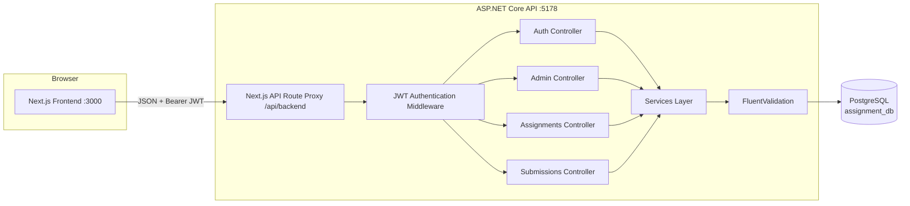
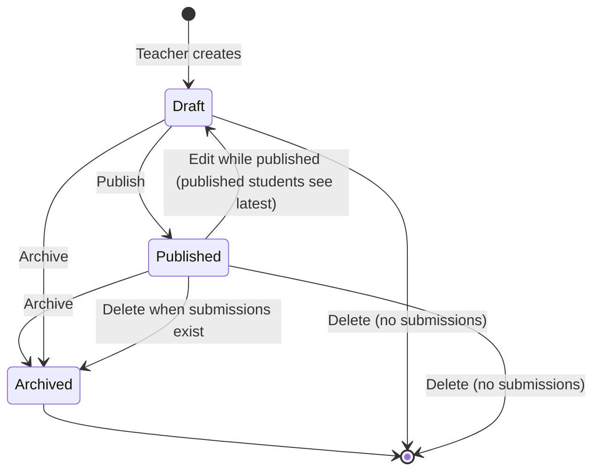
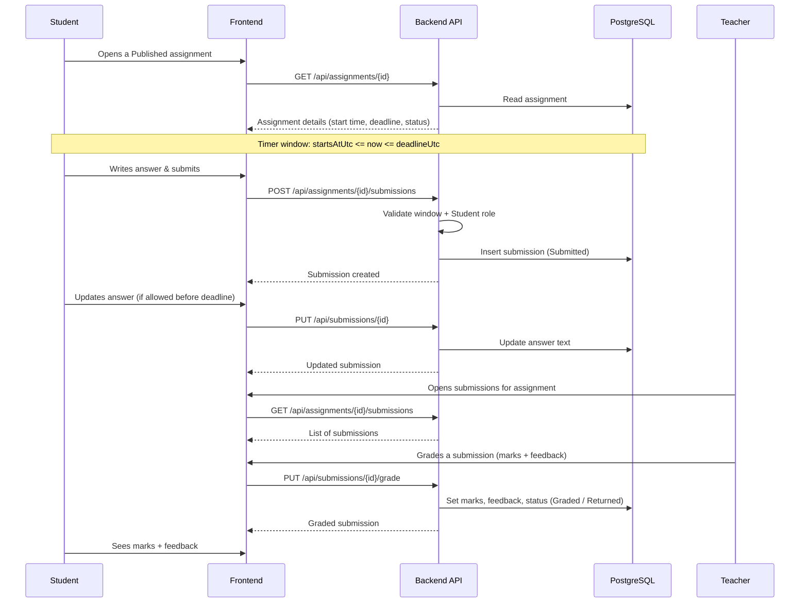
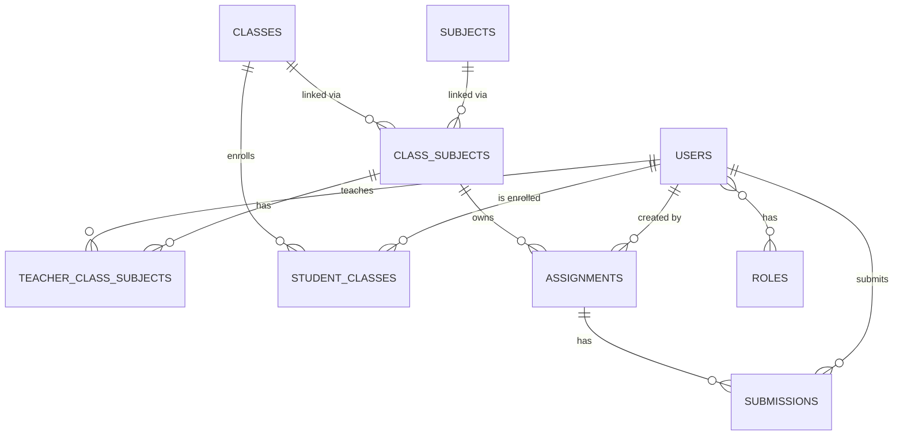

# assignment-management-backend-dotnet

The backend REST API for the **Assignment & Submission Management System**. It powers the
frontend with authentication, role-based authorization, class/subject administration,
assignment lifecycle management, student submissions, and grading.

- Framework: **.NET 10** / ASP.NET Core Web API
- Database: **PostgreSQL** with **Entity Framework Core** (Npgsql provider)
- Auth: **JWT** (JwtBearer) + **BCrypt** password hashing
- Validation: **FluentValidation**
- Config: **DotNetEnv** (loads a `.env` file into config on startup)
- Logging: **Serilog** (console)
- API docs: **Swagger / Swashbuckle**
- Tests: **xUnit**

> **Related repository — Frontend (Next.js):** [sawmikcuet19/assignment-management-frontend](https://github.com/sawmikcuet19/assignment-management-frontend)
> The web client that consumes this API. Start this backend first, then run the frontend.

---

## Table of contents

1. [Features](#features)
2. [Tech stack](#tech-stack)
3. [Project structure](#project-structure)
4. [Flow charts](#flow-charts)
5. [Getting started](#getting-started)
6. [Terminal commands](#terminal-commands)
7. [Database](#database)
8. [API reference](#api-reference)
9. [Configuration](#configuration)
10. [Security](#security)

---

## Features

- **Authentication & registration** — email + password login, JWT issuance, public
  student self-registration (teachers/admins are provisioned by an administrator).
- **Role-based authorization** — `Admin`, `Teacher`, and `Student` roles enforced on every
  endpoint.
- **Admin management** — users, classes, subjects, class-subject links, teacher assignment,
  and student enrollment.
- **Assignment lifecycle** — create drafts, publish, archive, and delete; optional
  **start time + deadline** (open/closed timer window).
- **Submissions** — students submit/update answers inside the timer window; teachers grade
  with marks and feedback (`Submitted → UnderReview → Graded/Returned`).
- **Rate limiting** on authentication endpoints to deter brute-force attempts.
- **Seed data** — roles, demo users, a class, a subject, and a sample published assignment
  are created automatically on first run.

## Tech stack

| Concern         | Technology                                             |
| --------------- | ------------------------------------------------------ |
| Runtime         | .NET 10 (C# 13)                                        |
| API framework   | ASP.NET Core Web API + Minimal hosting (`WebApplication`) |
| ORM             | EF Core 10 + Npgsql.EntityFrameworkCore.PostgreSQL 10   |
| Database        | PostgreSQL                                             |
| Authentication  | Microsoft.AspNetCore.Authentication.JwtBearer 10       |
| Password hashing| BCrypt.Net-Next                                        |
| Validation      | FluentValidation 12                                    |
| Logging         | Serilog.AspNetCore                                     |
| API docs        | Swashbuckle.AspNetCore (Swagger UI)                    |
| Tests           | xUnit, Microsoft.NET.Test.Sdk, EF Core Sqlite (in-memory) |

## Project structure

```
backend/
├── AssignmentManagement.slnx            # Solution file
├── src/
│   └── AssignmentManagement.Api/
│       ├── Program.cs                   # App bootstrap: DI, JWT, Swagger, CORS, rate limiting
│       ├── appsettings.json             # Connection string, JWT, CORS, Serilog config
│       ├── Auth/
│       │   ├── CurrentUser.cs           # Current authenticated user accessor
│       │   └── JwtTokenService.cs       # Token creation
│       ├── Controllers/
│       │   ├── AuthController.cs        # /api/auth (login, register)
│       │   ├── AdminController.cs       # /api/admin (users, classes, subjects, links)
│       │   ├── AssignmentsController.cs # /api/assignments
│       │   └── SubmissionsController.cs # /api/assignments/{id}/submissions, /api/submissions
│       ├── Services/
│       │   ├── AuthService.cs
│       │   ├── AdminService.cs
│       │   ├── AssignmentService.cs
│       │   └── SubmissionService.cs
│       ├── Domain/                      # EF Core entities
│       │   ├── User.cs, Role.cs, Assignment.cs, Submission.cs,
│       │   ├── ClassCourse.cs, Subject.cs, ClassSubject.cs,
│       │   ├── TeacherClassSubject.cs, StudentClass.cs,
│       │   ├── SubmissionAttachment.cs, AuditLog.cs, AppSetting.cs, Enums.cs
│       ├── Dtos/                        # Request/response models
│       ├── Validators/                  # FluentValidation validators
│       ├── Middleware/
│       │   ├── ExceptionMiddleware.cs   # Global error handling
│       │   └── ValidationFilter.cs      # Automatic model validation
│       ├── Data/
│       │   ├── AppDbContext.cs          # EF Core DbContext
│       │   └── DbSeeder.cs              # Auto-migrate + seed demo data
│       └── Migrations/                  # EF Core migration snapshots
└── tests/
    └── AssignmentManagement.Tests/      # xUnit tests (auth, assignments, submissions)
```

## Flow charts

### High-level architecture



### Assignment lifecycle



### Student submission & grading flow



## Getting started

### Prerequisites

- [.NET SDK 10.0](https://dotnet.microsoft.com/download/dotnet/10.0) or later
- [PostgreSQL 15+](https://www.postgresql.org/download/) running locally
- (Optional) the frontend app, see the [frontend README](https://github.com/sawmikcuet19/assignment-management-frontend)

### 1. Create the database

Create an empty database named `assignment_db` (or any name you like). Then set your
connection string (and other secrets) in a `.env` file copied from the committed template:

```bash
# Linux/macOS
cp .env.example .env

# Windows
copy .env.example .env
```

Edit `.env` to match your PostgreSQL credentials. The `__` keys map to `appsettings.json`
(see [Configuration](#configuration)):

```dotenv
ConnectionStrings__DefaultConnection=Host=localhost;Port=5432;Database=assignment_db;Username=postgres;Password=password
```

> The connection string can also be overridden directly with the environment variable
> `ConnectionStrings__DefaultConnection` — but prefer `.env` so secrets stay out of your shell
> history. `.env` is git-ignored; only `.env.example` is committed.

### 2. Restore and build

```bash
dotnet restore AssignmentManagement.slnx
dotnet build AssignmentManagement.slnx
```

### 3. Run

```bash
dotnet run --project src/AssignmentManagement.Api
```

On startup the API **automatically applies pending EF Core migrations** and seeds demo data
(roles, users, a class/subject, and a sample published assignment).

- API (HTTP): http://localhost:5178
- Swagger UI: http://localhost:5178/swagger

### 4. Run the tests

```bash
dotnet test AssignmentManagement.slnx
```

## Terminal commands

```bash
# Restore NuGet packages
dotnet restore AssignmentManagement.slnx

# Build the solution
dotnet build AssignmentManagement.slnx

# Run the API (auto-migrate + seed on startup)
dotnet run --project src/AssignmentManagement.Api

# Development watch mode (auto-restart on file changes)
dotnet watch run --project src/AssignmentManagement.Api

# Run the xUnit test suite
dotnet test AssignmentManagement.slnx

# Run tests with detailed output
dotnet test AssignmentManagement.slnx -v normal

# Add a new EF Core migration
dotnet ef migrations add <MigrationName> --project src/AssignmentManagement.Api

# Remove the last migration
dotnet ef migrations remove --project src/AssignmentManagement.Api

# Apply migrations to the database manually (optional; startup auto-applies them)
dotnet ef database update --project src/AssignmentManagement.Api
```

### Build the backend from scratch (fresh clone)

Complete sequence from a brand-new machine or CI job:

```bash
# 1. Clone the repository
git clone git@github.com:sawmikcuet19/assignment-management-backend-dotnet.git
cd assignment-management-backend-dotnet

# 2. Make sure PostgreSQL is running and set the connection string
#    (src/AssignmentManagement.Api/appsettings.json or the env var
#    ConnectionStrings__DefaultConnection). Defaults are already provided.

# 3. Restore NuGet packages
dotnet restore AssignmentManagement.slnx

# 4. Build the solution (restores + compiles; fails on any error)
dotnet build AssignmentManagement.slnx

# 5. Run the API — applies EF Core migrations and seeds demo data automatically
dotnet run --project src/AssignmentManagement.Api

# 6. Verify it is up:
#    API:     http://localhost:5178
#    Swagger: http://localhost:5178/swagger

# 7. Run the test suite (24 tests: auth, assignments, submissions)
dotnet test AssignmentManagement.slnx
```

### Scaffold the backend from an empty folder

Everything below recreates this repository from zero — no clone needed. It mirrors exactly
how the project was originally bootstrapped (the same commands live in `do.txt`).

> Prerequisites: **git**, **.NET SDK 10.0+**, **PostgreSQL 15+** running locally.

```bash
# 1. Create the folder and initialize git
mkdir assignment-management-backend-dotnet
cd assignment-management-backend-dotnet
git init

# 2. Create the solution file (the .NET 10 SDK defaults to the new .slnx format)
dotnet new sln -n AssignmentManagement

# 3. Create the API project (controllers-based Web API)
dotnet new webapi -n AssignmentManagement.Api -o src/AssignmentManagement.Api --use-controllers
dotnet sln add src/AssignmentManagement.Api

# 4. Remove the sample files the webapi template ships with
del src\AssignmentManagement.Api\WeatherForecast.cs
del src\AssignmentManagement.Api\Controllers\WeatherForecastController.cs
del src\AssignmentManagement.Api\AssignmentManagement.Api.http

# 5. Add the NuGet dependencies used by the API
dotnet add src/AssignmentManagement.Api package BCrypt.Net-Next --version 4.2.0
dotnet add src/AssignmentManagement.Api package DotNetEnv --version 3.2.0
dotnet add src/AssignmentManagement.Api package FluentValidation.DependencyInjectionExtensions --version 12.1.1
dotnet add src/AssignmentManagement.Api package Microsoft.AspNetCore.Authentication.JwtBearer --version 10.0.10
dotnet add src/AssignmentManagement.Api package Microsoft.AspNetCore.OpenApi --version 10.0.10
dotnet add src/AssignmentManagement.Api package Microsoft.EntityFrameworkCore --version 10.0.10
dotnet add src/AssignmentManagement.Api package Microsoft.EntityFrameworkCore.Design --version 10.0.10
dotnet add src/AssignmentManagement.Api package Npgsql.EntityFrameworkCore.PostgreSQL --version 10.0.3
dotnet add src/AssignmentManagement.Api package Serilog.AspNetCore --version 10.0.0
dotnet add src/AssignmentManagement.Api package Swashbuckle.AspNetCore --version 10.2.3

# 6. Install the EF Core CLI tool (global, once)
dotnet tool install --global dotnet-ef

# 7. Create the xUnit test project and link it to the API
dotnet new xunit -n AssignmentManagement.Tests -o tests/AssignmentManagement.Tests
dotnet add tests/AssignmentManagement.Tests reference src/AssignmentManagement.Api
dotnet add tests/AssignmentManagement.Tests package Microsoft.EntityFrameworkCore.Sqlite --version 10.0.10
dotnet add tests/AssignmentManagement.Tests package SQLitePCLRaw.bundle_e_sqlite3 --version 3.0.5
dotnet sln add tests/AssignmentManagement.Tests
del tests\AssignmentManagement.Tests\UnitTest1.cs   # xunit template sample test

# 8. Copy the .env template and fill in your secrets (.env itself is git-ignored)
copy .env.example .env

# 9. Generate the migrations (the API applies them automatically on startup)
dotnet ef migrations add InitialCreate --project src/AssignmentManagement.Api
dotnet ef migrations add AddAssignmentStartsAtUtc --project src/AssignmentManagement.Api
dotnet ef migrations add RemoveSubmissionIsLate --project src/AssignmentManagement.Api

# 10. Restore, build, run, and test
dotnet restore AssignmentManagement.slnx
dotnet build AssignmentManagement.slnx
dotnet run --project src/AssignmentManagement.Api
dotnet test AssignmentManagement.slnx
```

> Each `dotnet add package` above also has a `--version`-less form
> (`dotnet add <project> package <Name>`) that installs the latest compatible version.

## Database

The API uses **PostgreSQL** via Entity Framework Core. Migrations are stored under
`src/AssignmentManagement.Api/Migrations` and are applied automatically at startup.

### Connection string

```json
"ConnectionStrings": {
  "DefaultConnection": "Host=localhost;Port=5432;Database=assignment_db;Username=postgres;Password=password"
}
```

| Setting | Default | Purpose |
| ------- | ------- | ------- |
| `Host`  | `localhost` | PostgreSQL server address |
| `Port`  | `5432`      | PostgreSQL port |
| `Database` | `assignment_db` | Database name |
| `Username` | `postgres` | Database user |
| `Password` | `password` | Database user password |

### Tables

| Table | Purpose |
| ----- | ------- |
| `Roles` | `Admin`, `Teacher`, `Student` |
| `Users` | User accounts (name, email, BCrypt password hash, active flag) |
| `ClassCourses` | School classes (e.g. "Class 9") |
| `Subjects` | School subjects (e.g. "Mathematics") |
| `ClassSubjects` | Links a class to a subject (the unit assignments belong to) |
| `TeacherClassSubjects` | Assigns a teacher to a class-subject |
| `StudentClasses` | Enrolls a student in a class |
| `Assignments` | Title, description, max marks, start time, deadline, status |
| `Submissions` | Student answer, status, marks, feedback |
| `SubmissionAttachments` | (reserved) file attachments for submissions |
| `AppSettings` | Key/value application settings |
| `AuditLogs` | Audit trail of important actions |

### Key relationships



### Migrations

Current migration history (latest at the bottom):

| Migration | Description |
| --------- | ----------- |
| `InitialCreate` | Base schema (all entities) |
| `AddAssignmentStartsAtUtc` | Adds `StartsAtUtc` (timer start) to assignments |
| `RemoveSubmissionIsLate` | Removes the unused `IsLate` flag from submissions |

### Seeded demo data

Created automatically on first run:

| Type | Value |
| ---- | ----- |
| Roles | `Admin`, `Teacher`, `Student` |
| Admin user | `admin@school.local` / `password` |
| Teacher user | `teacher@school.local` / `password` |
| Student user | `student@school.local` / `password` |
| Class | Class 9 (`C9`) |
| Subject | Mathematics (`MATH`) |
| Class-subject link | Class 9 + Mathematics (2026) |
| Sample assignment | "Chapter 1 Homework" — Published, deadline +7 days |

## API reference

All endpoints return JSON. Protected endpoints require:

```
Authorization: Bearer <jwt>
```

### Auth

| Method | Path | Access | Description |
| ------ | ---- | ------ | ----------- |
| `POST` | `/api/auth/login` | Public | Login with email + password, returns JWT |
| `POST` | `/api/auth/register` | Public | Create a Student account |

### Admin (role: `Admin`)

| Method | Path | Description |
| ------ | ---- | ----------- |
| `GET` / `POST` | `/api/admin/users` | List / create users |
| `PUT` / `DELETE` | `/api/admin/users/{id}` | Update / deactivate a user |
| `GET` / `POST` | `/api/admin/classes` | List / create classes |
| `PUT` / `DELETE` | `/api/admin/classes/{id}` | Update / deactivate a class |
| `GET` / `POST` | `/api/admin/subjects` | List / create subjects |
| `PUT` / `DELETE` | `/api/admin/subjects/{id}` | Update / deactivate a subject |
| `GET` / `POST` | `/api/admin/class-subjects` | List / create class-subject links |
| `PUT` / `DELETE` | `/api/admin/class-subjects/{id}` | Update / deactivate a link |
| `GET` / `POST` | `/api/admin/class-subjects/{id}/teachers` | List / assign teachers |
| `DELETE` | `/api/admin/class-subjects/{id}/teachers/{userId}` | Remove a teacher |
| `GET` / `POST` | `/api/admin/classes/{id}/students` | List / enroll students |
| `DELETE` | `/api/admin/classes/{id}/students/{userId}` | Remove a student |

### Assignments (authenticated)

| Method | Path | Access | Description |
| ------ | ---- | ------ | ----------- |
| `GET` | `/api/assignments` | All roles | List assignments (scoped to role) |
| `GET` | `/api/assignments/class-subjects` | Teacher | Class-subjects the teacher teaches |
| `GET` | `/api/assignments/{id}` | All roles | Assignment details |
| `POST` | `/api/assignments` | Teacher | Create an assignment |
| `PUT` | `/api/assignments/{id}` | Teacher, Admin | Update an assignment |
| `POST` | `/api/assignments/{id}/publish` | Teacher, Admin | Publish (Draft → Published) |
| `POST` | `/api/assignments/{id}/archive` | Teacher, Admin | Archive |
| `DELETE` | `/api/assignments/{id}` | Teacher, Admin | Delete (or archive if submissions exist) |

### Submissions (authenticated)

| Method | Path | Access | Description |
| ------ | ---- | ------ | ----------- |
| `POST` | `/api/assignments/{id}/submissions` | Student | Submit an answer (inside timer window) |
| `GET` | `/api/assignments/{id}/submissions/me` | Student | The student's own submission |
| `GET` | `/api/assignments/{id}/submissions` | Teacher, Admin | All submissions for an assignment |
| `GET` | `/api/submissions/{id}` | Owner / Teacher / Admin | A single submission |
| `PUT` | `/api/submissions/{id}` | Student | Update answer (if allowed before deadline) |
| `PUT` | `/api/submissions/{id}/grade` | Teacher, Admin | Grade with marks + feedback |

## What each role can do

| Capability | Student | Teacher | Admin |
| ---------- | ------- | ------- | ----- |
| Register a new account | ✅ (as Student) | ❌ | ❌ |
| Login and receive a JWT | ✅ | ✅ | ✅ |
| List published assignments | ✅ own classes only | ✅ own class-subjects only | ✅ all |
| Create / edit / publish / archive / delete assignments | ❌ | ✅ own class-subjects | ✅ |
| Submit an answer | ✅ inside the timer window only | ❌ | ❌ |
| Update an answer | ✅ if allowed & before deadline | ❌ | ❌ |
| View a submission | ✅ own only | ✅ for own classes | ✅ all |
| Grade submissions (marks + feedback) | ❌ | ✅ | ❌ |
| Manage users / classes / subjects | ❌ | ❌ | ✅ |
| Assign teachers / enroll students | ❌ | ❌ | ✅ |

## Configuration

Settings are read from `src/AssignmentManagement.Api/appsettings.json` first, then overridden
by environment variables, then by a **`.env`** file in the backend root (loaded on startup).
`.env` uses ASP.NET Core's double-underscore convention:

| `.env` key | Maps to | Default |
| ---------- | ------- | ------- |
| `ConnectionStrings__DefaultConnection` | `ConnectionStrings:DefaultConnection` | local PostgreSQL `assignment_db` |
| `Jwt__Issuer` | `Jwt:Issuer` | `AssignmentManagement.Api` |
| `Jwt__Audience` | `Jwt:Audience` | `AssignmentManagement.Web` |
| `Jwt__Secret` | `Jwt:Secret` | dev secret in `appsettings.json` |
| `Jwt__ExpiryMinutes` | `Jwt:ExpiryMinutes` | `60` |
| `Cors__AllowedOrigins__0` | `Cors:AllowedOrigins[0]` | `http://localhost:3000` |

`appsettings.json` table:

| Key | Description | Default |
| --- | ----------- | ------- |
| `ConnectionStrings:DefaultConnection` | PostgreSQL connection string | `Host=localhost;Port=5432;Database=assignment_db;...` |
| `Jwt:Issuer` | JWT issuer | `AssignmentManagement.Api` |
| `Jwt:Audience` | JWT audience | `AssignmentManagement.Web` |
| `Jwt:Secret` | Signing key (min 32 bytes for HS256) | dev secret |
| `Jwt:ExpiryMinutes` | Token lifetime | `60` |
| `Cors:AllowedOrigins` | Allowed browser origins | `http://localhost:3000` |
| `Serilog:MinimumLevel` | Log level overrides | Information |

### Setting up your own `.env`

```bash
# Linux/macOS
cp .env.example .env

# Windows
copy .env.example .env
```

Then edit `.env` with your real PostgreSQL credentials and a fresh JWT secret. The `.env`
file is **git-ignored**; only the `.env.example` template (with dummy values) is committed.

## Security

- **Password hashing** — BCrypt with per-user salts; plaintext passwords are never stored.
- **JWT authentication** — symmetric HS256 signing, issuer/audience/lifetime validated.
- **Role-based authorization** — `[Authorize(Roles = "...")]` on controllers and actions.
- **Rate limiting** — `10 requests/minute` per IP on `/api/auth/login` and `/api/auth/register`
  (429 Too Many Requests on breach).
- **Centralized errors** — `ExceptionMiddleware` returns consistent problem-detail JSON.
- **Input validation** — FluentValidation validators run via `ValidationFilter` on every request.
- **Scoped data** — teachers only manage their own class-subjects, students only see/act on
  assignments and submissions in their scope (enforced in the service layer).

---

Built for demonstration purposes. See the
[frontend README](https://github.com/sawmikcuet19/assignment-management-frontend) for the
Next.js client that consumes this API.
